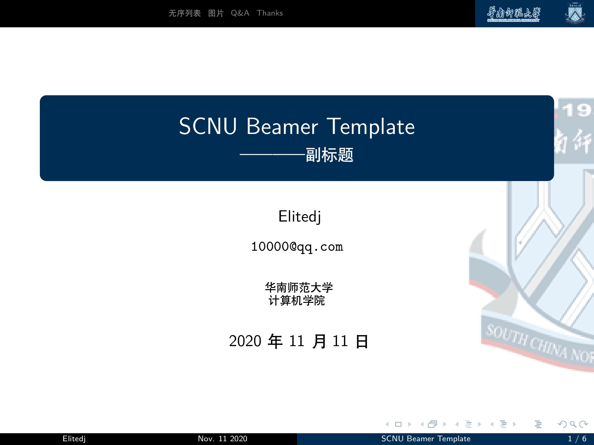
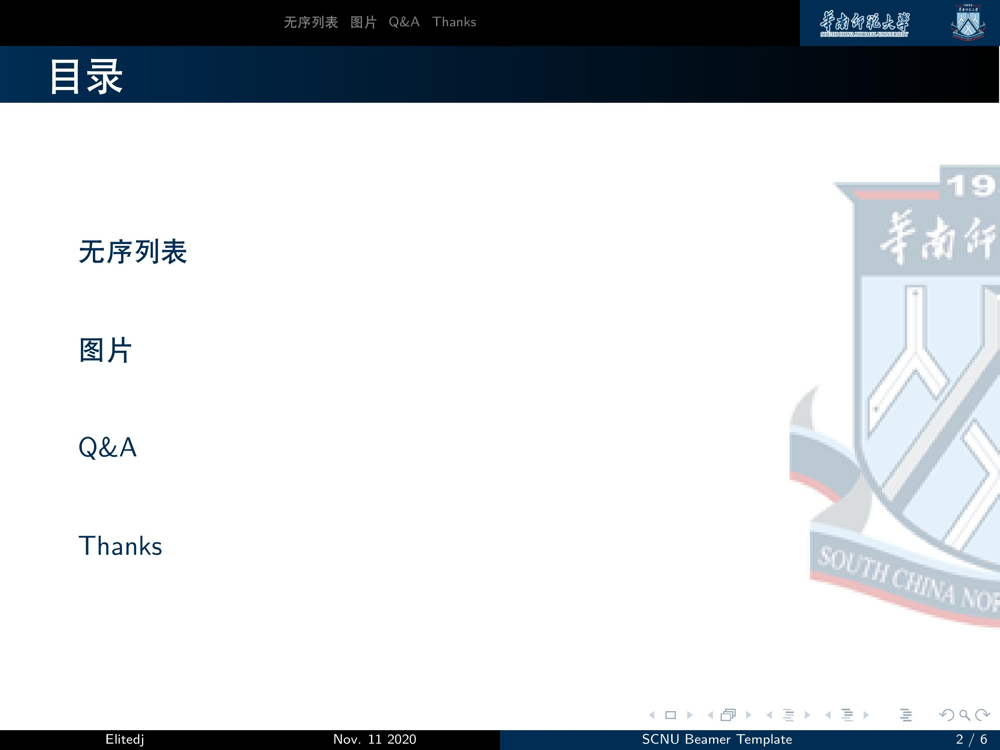
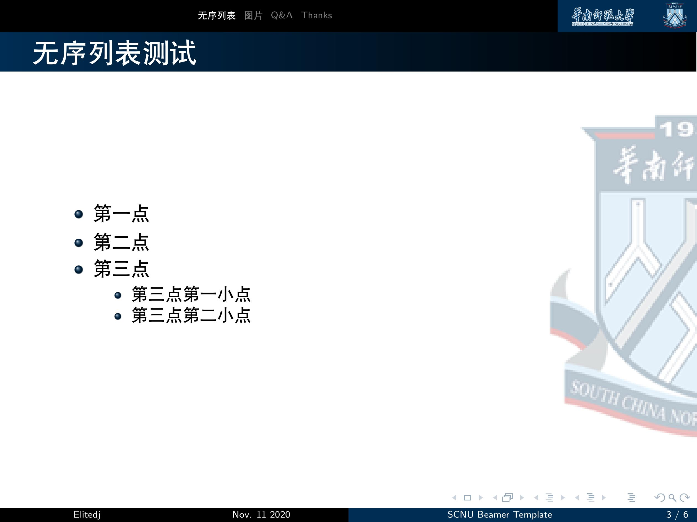
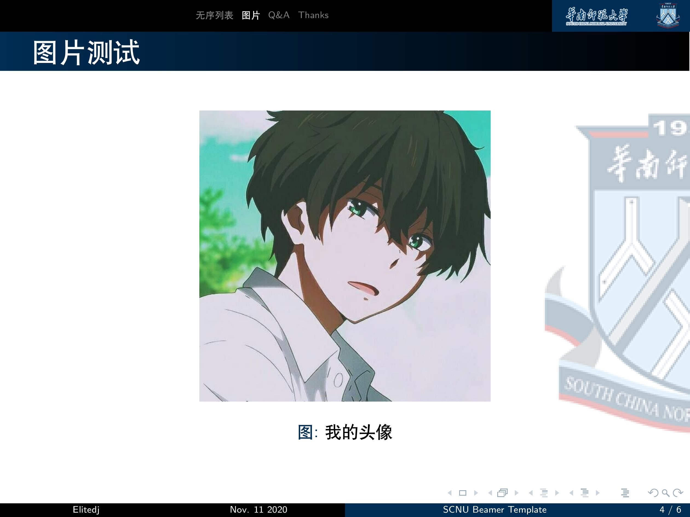
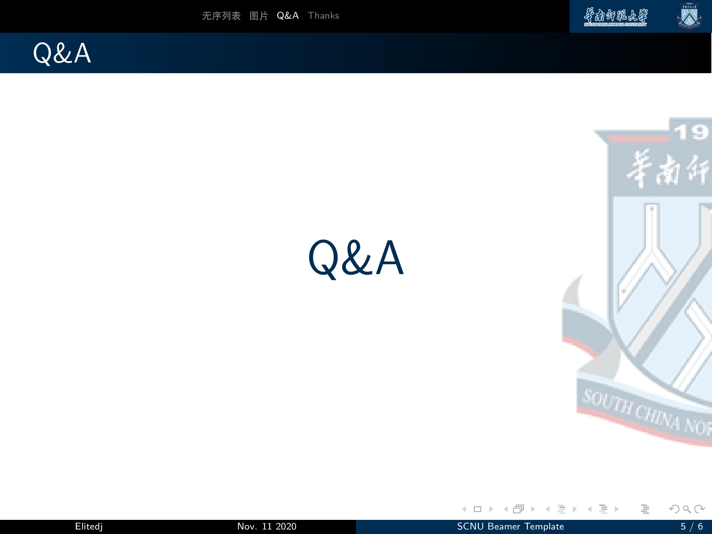
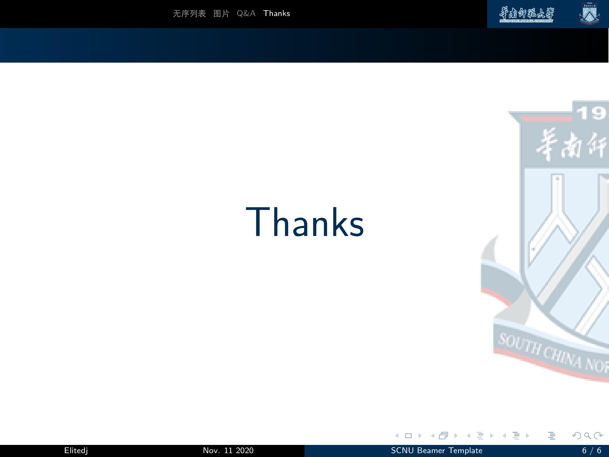

# 华南师范大学Beamer模板

## 参考
- [华中师范大学Beamer模板](https://github.com/K-JW/CCNU_BeamerTemplate)
- 将学校logo和配色修改为华南师范大学
- 将ppt比例改为4:3


## 使用
- 编译
```
./build.sh
```

- pdf2pptx
可以使用[这个脚本](https://github.com/Elitedj/pdf2pptx)

## 效果






